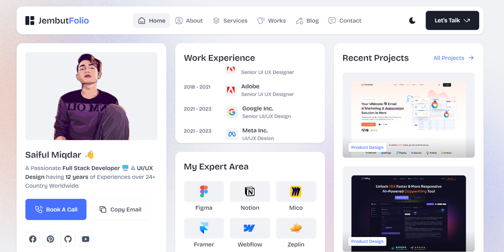

# JembutFolio - Tailwind Minimal CSS Personal Portfolio HTML5 Template

Live Preview : [See Here](https://ifulxploit.github.io/jembutfolio/)  

Author: [ifulxploit](saifulmiqdar.vercel.app)  
Email: [ifulxploit@gmail.com](mailto:ifulxploit@gmail.com)  
WhatsApp: [083871259489](https://wa.me/6283871259489)  

---

Do you intend to create your own Portfolio website? You are in the right place. **JembutFolio Tailwind CSS Minimal Personal Portfolio Template** is designed for all kinds of Online Professionals such as Product Designers, UI UX Designers, CVs, Resumes, Web Developers, Programmers, Content Creators, Photographers, Marketers, Agencies, Startups, Small Business Owners, Tech Entrepreneurs, and many more.

**JembutFolio - Tailwind Personal Portfolio Template** comes with modern UI with 30+ Modern UI Components. Bentofolio is 100% responsive and looks stunning on all types of screens and devices. Bentofolio is a blend of modern, classic, creative and clean style with better UI UX and is the right choice for your needs. Users will love your site because it provides the best user experience (UX) and User Interface (UI).

Moreover, **JembutFolio** is a well-presented and documented HTML template built with the world's most popular CSS framework, TailwindCSS, HTML5, CSS3, SCSS, JS, and many other modern technology features. It offers a homepage along with other important pages with two different theme variations (dark/light).

**JembutFolio** is fully compatible with all major browsers, including Google Chrome, Microsoft Edge, Firefox, Safari, Brave (web browser), Vivaldi, and Internet Explorer 9+.

You can easily change text, content, Images, objects, and colour palettes. The file is very well organised.

## 😱 Template Features:
- Fully responsive template
- Tailwind CSS Framework
- Extensive Customisation Options
- Live UI Switcher Mode (Dark & Light)
- W3C validated code
- Smooth Animation
- 30+ Modern UI Components
- Creative, clean, unique and modern style
- Totally SEO optimised code
- Pixel-perfect design
- Retina ready (High quality design)
- Free and Custom-made Illustrations
- Free Images and Google fonts used
- Full Documentation & Support
- Regular Updates
- And much more

## 📂 Files Included:
- 7+ HTML Files 
- 1 Documentation File

---

### How to Contribute 🚀
Thank you for considering contributing to **JembutFolio**! Here's how you can contribute:

0. give me a star on this repository 💫
1. Fork the repository and clone it locally.🍽️
2. Create a new branch for your feature, bug fix, or add your website here. 🌿
3. Make your changes and commit them with clear commit messages. 💌
4. Push your changes to your fork. 🫸
5. Submit a pull request, explaining the changes you made and why they should be merged. 💞

We welcome contributions from everyone, regardless of your level of experience! Let's make **JembutFolio** even better together.😹
